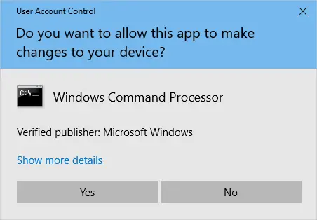

User Account Control is a mandatory access control enforcement feature introduced with Microsoft's Windows Vista and Windows Server 2008 operating systems, with a more relaxed version also present in Windows 7, Windows Server 2008 R2, Windows 8, Windows Server 2012 and Windows 10. (Wikipedia)

When User Account Control (UAC) is enabled, Windows prompts for consent or prompts for credentials of a valid local administrator account before starting a program or task that requires a full administrator access token. This prompt ensures that no malicious software can be silently installed or run.

We can bypass this using a simple trick. In this example I will use `regedit`

> ⚠ The method below can be used in situations where there is a direct access to the system either via RDP or physical.

# Creating the task

- Press WIN+R and open **taskschd.msc**, Schtasks bypasses the UAC when ran on highest privileges. It does not grant you free admin access but it skips the consent prompt.
- Right click on Tash Schedule Library and create a new folder, I will name it `uac_bypass`

- Now create a new task, name it however you want and set `Run with highest privileges` check.

- Now go in the `Actions` tab and create a new action, specify the action to be `Start a program` and select the program you want to launch.

- Select the newly created task and click Run

- Regedit will open without any UAC prompt.

